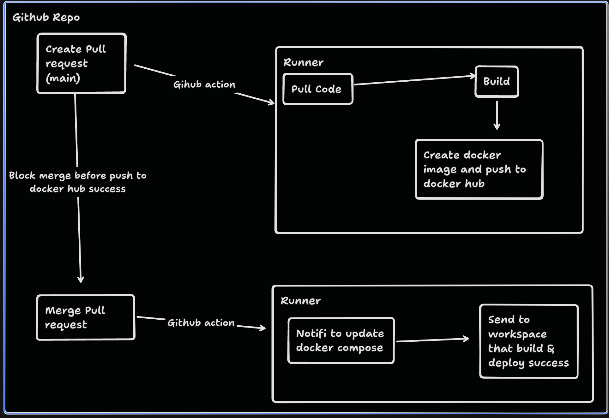

# 678510342
Nhóm chủ đề migrate từ ứng dụng/hệ thống on-premise sang docker/kuberness,
tự động quá trình deploy với mã nguồn từ github.

## Thành viên
- Nguyễn Thành Hưng - B20DCCN342
- Phạm Tiến Thuận - B20DCCN678
- Lê Quang Phúc - B20DCCN510

## Mô tả bài toán
Ở công ty product nhỏ, được chia ra thành 2 phòng ban backend Spring Boot
và frontend React.
Backend sử dụng Spring Boot
Database ...
Hiện tại, hệ thống đang chạy on-premise.
do kinh phí hạn chế nên không thể sử dụng các dịch vụ cloud.
và tất cả các resources đều được chạy trên 1 host machine.

- Usecase 1: Phòng ban cần deploy ứng dụng lên host machine đều cần phải thông báo

- Usecase 2: Khi update version, môi trường ở host machine phải được cập nhật thủ công.

- Usecase 3: Việc tra cứu trách nhiệm sẽ khó khăn do những thao tác cần
  phải thực hiện thủ công trên host machine.

## Mong muốn
Mong muốn chuyển hệ thống sang docker để dễ dàng quản lý, scale và
để giảm sự phụ thuộc vào host machine của các phòng ban.

## Phân tích / Thiết kế bài toán
[Document](https://docs.google.com/document/d/1BBJNlAX6A7exMp9Kt43mJgpwVA2Pb-x_sR-0Wm0NHck/edit?usp=sharing)

## Mô tả giải pháp
- Sử dụng Docker để containerize các service.
- Sử dụng Docker Compose để quản lý các container.
- Sử dụng Github Action để tự động hóa quá trình deploy.
  

## Ngôn ngữ và Framework sử dụng
- Frontend: ReactJs
- Backend: Java Spring boot
- Database: ...
- Kiến trúc: Microservice
- Triển khai: Docker

## Tool Support
- Github Action
- Docker
- .....
